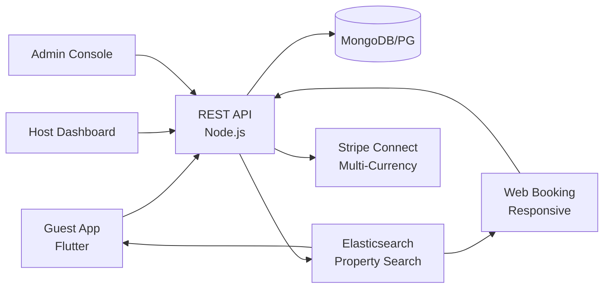

# Habyt Clone — White-Label Short-Term Rental & Booking Platform by Miracuves

**MXEstate** is a production-ready, white-label Habyt clone: a complete short-term rental platform with guest, host, and admin panels — delivered with **100% source code ownership** in **6 working days**.

> 🏠 **See it running before you talk to anyone.** Live guest app, host dashboard, and admin console — demo credentials are printed on the [solution page](https://miracuves.com/habyt-clone#demo). No sales call required.

---

## 🚀 Live Demos

| Environment | URL | What you can test |
|---|---|---|
| 📱 Guest App | [mas.mimeld.com](https://mas.mimeld.com) | Search, book, pay, review, message host |
| 🌐 Web Booking | [mxestate.mimeld.com](https://mxestate.mimeld.com) | Full booking experience in the browser |
| 🏡 Host Dashboard | [Solution page → Demo](https://miracuves.com/habyt-clone#demo) | Listings, calendar, pricing, messaging, payouts |
| 🛠️ Admin Console | [Solution page → Demo](https://miracuves.com/habyt-clone#demo) | Hosts, listings, payments, disputes, analytics |

Demo credentials for all environments: **[miracuves.com/habyt-clone → Demo section](https://miracuves.com/habyt-clone/#demo)**

---

## ✨ What Makes This Habyt Clone Different

Most rental scripts stop at "list + book." This platform ships with the features that actually run a rental *business*:

- **Smart Pricing Engine** — nightly prices adjust to demand, season, and local events — same dynamic-pricing algorithm Airbnb patented
- **Verified Identity Built-In** — government-ID + selfie verification for hosts and guests — production-grade KYC, not just email + phone
- **Multi-Currency + Multi-Language** — 40+ currencies with auto-conversion, 15+ languages with locale-aware content — built for cross-border rentals
- **Co-Host & Team Access** — hosts can invite co-hosts, cleaners, and operations staff — each with their own permission level and inbox
- **Stripe Connect for Host Payouts** — hosts get paid in their local currency, with 1099 / tax-handling in 30+ countries — Airbnb's most-copied infrastructure

## 📦 Core Features

**Guest:** search & map view · filters · wishlists · secure payment · review system · messaging host · trip history · multi-language

**Host:** listing wizard · smart pricing · calendar management · guest messaging · co-host support · payouts · performance analytics

**Admin:** host verification · listing moderation · payment escrow · dispute resolution · trust & safety · analytics reports

## 🏗️ Architecture

**Stack:** Flutter mobile apps (Android + iOS) · Node.js or Laravel backend · MongoDB/PostgreSQL · Elasticsearch for property search · Stripe Connect for multi-currency payouts · Stripe Connect, regional gateways, multi-currency

## 📋 What’s Included

- ✅ Full source code — backend, web, mobile apps, panels (no encryption, no license locks)
- ✅ Deployment to your servers & app store submission assistance
- ✅ Your branding — white-label rename, logo, colors, domain
- ✅ 60 days post-launch support + 12 months of free updates
- ✅ Documentation & handover

**Pricing:** from **$8,499**, transparent on the [solution page](https://miracuves.com/habyt-clone/#pricing) — no "contact us for quote" games.

## 🆚 Why Not Build From Scratch?

Custom rental platforms run $80k–$400k and 6–12 months. A proven white-label base gets you to market in 6 working days for a fraction of that, with your budget preserved for host acquisition and demand-side marketing.

## 📚 Resources

- 📖 [Habyt Clone — Full Solution Page](https://miracuves.com/habyt-clone) (features, pricing, demos, FAQ)
- 💰 [How Much Does a Rental App Cost in 2026?](https://miracuves.com/habyt-clone#pricing) pricing breakdown & what's included
- 📝 [Best Habyt Clone Script in 2026](https://miracuves.com/habyt-clone/blog/) features, pricing & launch guide
- 🧠 [Dynamic Pricing for Short-Term Rentals](https://miracuves.com/habyt-clone/blog/) demand-based revenue management
- ✅ [Miracuves Facts & Claims Ledger](https://miracuves.com/habyt-clone/facts/) every claim we make, verified

## 🏢 About Miracuves

[Miracuves Solutions](https://miracuves.com) builds white-label clone apps and custom software from Mumbai, India — 90+ ready-made solutions, live demos for every product, transparent pricing, and delivery in 6 working days. Operating since 2010.

**Talk to us:** [WhatsApp](https://wa.me/919830009649) · [Schedule a consultation](https://miracuves.com/schedule-consultation/) · [miracuves.com](https://miracuves.com)

---

### ⚠️ Note on This Repository

This repository is a product overview. The full source code is delivered to clients on purchase — see [what’s included](https://miracuves.com/habyt-clone/#included). For a hands-on evaluation, use the live demos above; credentials are public on the solution page.

*Keywords: habyt clone, habyt clone script, rental marketplace, vacation rental, short-term rental, white label Airbnb, Flutter rental app, Node.js rental platform*

---

<!--
══════════════════════════════════════════════════
TEMPLATE VARIABLE KEY — auto-generated from Netflix-Clone pattern
══════════════════════════════════════════════════
{APP_NAME}        Habyt Clone
{MX_NAME}         MXEstate
{CATEGORY}        Short-Term Rental & Booking Platform
{DEMO_WEB}        mxestate.mimeld.com
{PRICE}           $8,499
{SLUG}            habyt-clone
{SOLUTION_URL}    https://miracuves.com/habyt-clone/
{VERTICAL}        rental

See /tmp/verticals/rental.txt for the vertical config used to generate this README.
══════════════════════════════════════════════════
-->